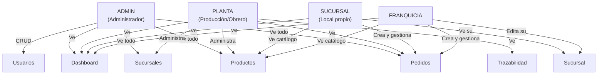
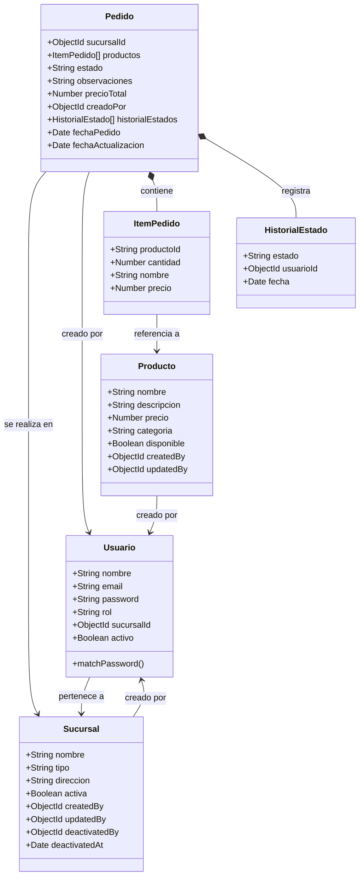
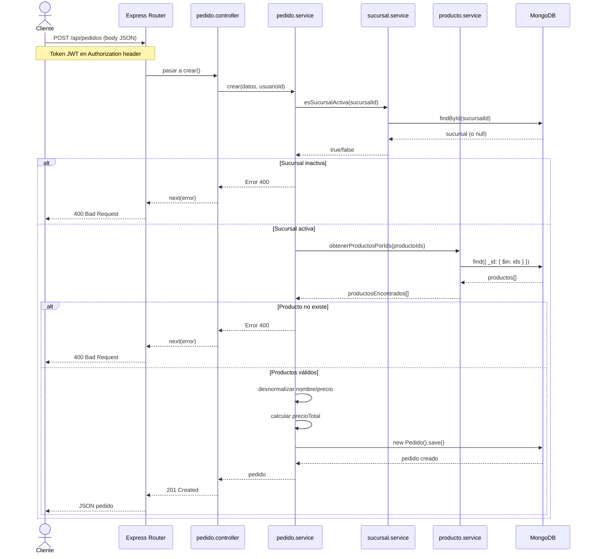
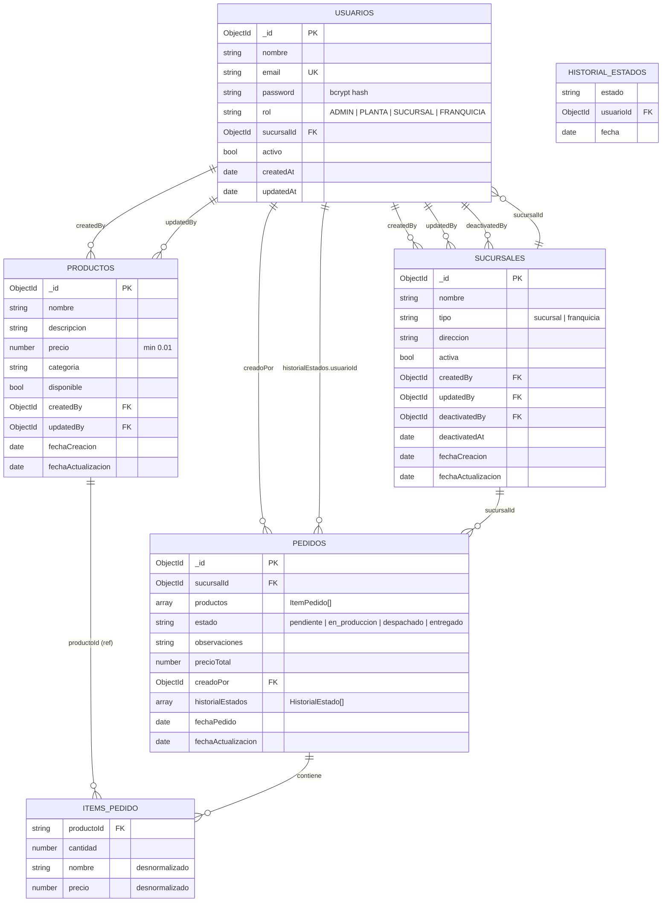

# Diagramas - La Espiga de Oro

## 1. Diagrama de Casos de Uso

```mermaid
graph TD
    A["ADMIN<br/>(Administrador)"]
    P["PLANTA<br/>(Producción/Obrero)"]
    S["SUCURSAL<br/>(Local propio)"]
    F["FRANQUICIA"]

    A -->|CRUD| Usuarios
    A -->|Ve| Dashboard
    A -->|Ve todo| Sucursales
    A -->|Ve todo| Productos
    A -->|Ve todo| Pedidos

    P -->|Administra| Productos
    P -->|Administra| Sucursales
    P -->|Ve| Dashboard
    P -->|Ve| Trazabilidad
    P -->|Ve| Pedidos

    S -->|Crea y gestiona| Pedidos
    S -->|Ve catálogo| Productos
    S -->|Ve su| Sucursal
    S -->|Ve| Dashboard

    F -->|Crea y gestiona| Pedidos
    F -->|Edita su| Sucursal
    F -->|Ve catálogo| Productos
    F -->|Ve| Dashboard
```

## 2. Diagrama de Clases (Entidades)

```mermaid
classDiagram
    class Usuario {
        +String nombre
        +String email
        +String password
        +String rol
        +ObjectId sucursalId
        +Boolean activo
        +matchPassword()
    }

    class Sucursal {
        +String nombre
        +String tipo
        +String direccion
        +Boolean activa
        +ObjectId createdBy
        +ObjectId updatedBy
        +ObjectId deactivatedBy
        +Date deactivatedAt
    }

    class Producto {
        +String nombre
        +String descripcion
        +Number precio
        +String categoria
        +Boolean disponible
        +ObjectId createdBy
        +ObjectId updatedBy
    }

    class ItemPedido {
        +String productoId
        +Number cantidad
        +String nombre
        +Number precio
    }

    class HistorialEstado {
        +String estado
        +ObjectId usuarioId
        +Date fecha
    }

    class Pedido {
        +ObjectId sucursalId
        +ItemPedido[] productos
        +String estado
        +String observaciones
        +Number precioTotal
        +ObjectId creadoPor
        +HistorialEstado[] historialEstados
        +Date fechaPedido
        +Date fechaActualizacion
    }

    Usuario --> Sucursal : pertenece a
    Pedido --> Sucursal : se realiza en
    Pedido --> Usuario : creado por
    Pedido *-- ItemPedido : contiene
    Pedido *-- HistorialEstado : registra
    ItemPedido --> Producto : referencia a
    Producto --> Usuario : creado por
    Sucursal --> Usuario : creado por
```

## 3. Diagrama de Secuencia — Crear Pedido

```mermaid
sequenceDiagram
    actor Cliente
    participant API as Express Router
    participant Controller as pedido.controller
    participant Service as pedido.service
    participant SucService as sucursal.service
    participant ProdService as producto.service
    participant DB as MongoDB

    Cliente->>API: POST /api/pedidos (body JSON)
    Note over Cliente,API: Token JWT en Authorization header
    API->>Controller: pasar a crear()
    Controller->>Service: crear(datos, usuarioId)
    Service->>SucService: esSucursalActiva(sucursalId)
    SucService->>DB: findById(sucursalId)
    DB-->>SucService: sucursal (o null)
    SucService-->>Service: true/false
    alt Sucursal inactiva
        Service-->>Controller: Error 400
        Controller-->>API: next(error)
        API-->>Cliente: 400 Bad Request
    else Sucursal activa
        Service->>ProdService: obtenerProductosPorIds(productoIds)
        ProdService->>DB: find({ _id: { $in: ids } })
        DB-->>ProdService: productos[]
        ProdService-->>Service: productosEncontrados[]
        alt Producto no existe
            Service-->>Controller: Error 400
            Controller-->>API: next(error)
            API-->>Cliente: 400 Bad Request
        else Productos válidos
            Service->>Service: desnormalizar nombre/precio
            Service->>Service: calcular precioTotal
            Service->>DB: new Pedido().save()
            DB-->>Service: pedido creado
            Service-->>Controller: pedido
            Controller-->>API: 201 Created
            API-->>Cliente: JSON pedido
        end
    end
```

## 4. Modelo de Datos (DER MongoDB)

```mermaid
erDiagram
    USUARIOS ||--o{ SUCURSALES : "createdBy"
    USUARIOS ||--o{ SUCURSALES : "updatedBy"
    USUARIOS ||--o{ SUCURSALES : "deactivatedBy"
    USUARIOS ||--o{ PRODUCTOS : "createdBy"
    USUARIOS ||--o{ PRODUCTOS : "updatedBy"
    USUARIOS ||--o{ PEDIDOS : "creadoPor"
    USUARIOS ||--o{ PEDIDOS : "historialEstados.usuarioId"

    SUCURSALES ||--o{ PEDIDOS : "sucursalId"
    SUCURSALES ||--o{ USUARIOS : "sucursalId"

    PRODUCTOS ||--o{ ITEMS_PEDIDO : "productoId (ref)"
    PEDIDOS ||--o{ ITEMS_PEDIDO : "contiene"

    USUARIOS {
        ObjectId _id PK
        string nombre
        string email UK
        string password "bcrypt hash"
        string rol "ADMIN | PLANTA | SUCURSAL | FRANQUICIA"
        ObjectId sucursalId FK
        bool activo
        date createdAt
        date updatedAt
    }

    SUCURSALES {
        ObjectId _id PK
        string nombre
        string tipo "sucursal | franquicia"
        string direccion
        bool activa
        ObjectId createdBy FK
        ObjectId updatedBy FK
        ObjectId deactivatedBy FK
        date deactivatedAt
        date fechaCreacion
        date fechaActualizacion
    }

    PRODUCTOS {
        ObjectId _id PK
        string nombre
        string descripcion
        number precio "min 0.01"
        string categoria
        bool disponible
        ObjectId createdBy FK
        ObjectId updatedBy FK
        date fechaCreacion
        date fechaActualizacion
    }

    PEDIDOS {
        ObjectId _id PK
        ObjectId sucursalId FK
        array productos "ItemPedido[]"
        string estado "pendiente | en_produccion | despachado | entregado"
        string observaciones
        number precioTotal
        ObjectId creadoPor FK
        array historialEstados "HistorialEstado[]"
        date fechaPedido
        date fechaActualizacion
    }

    ITEMS_PEDIDO {
        string productoId FK
        number cantidad
        string nombre "desnormalizado"
        number precio "desnormalizado"
    }

    HISTORIAL_ESTADOS {
        string estado
        ObjectId usuarioId FK
        date fecha
    }
```
